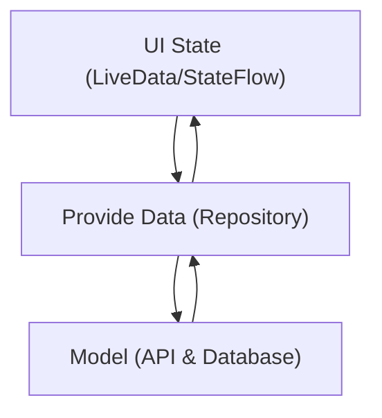

# **HoopHub**
**CMPT362 Final Project**

HoopHub is a basketball-focused mobile application that allows users to explore nearby basketball courts, manage profiles, and connect with players. The app follows the **MVVM (Model-View-ViewModel)** architecture for clean separation of concerns and scalability.

---

## **Features**
- **Players Section**: Explore and manage players in your network.
- **Courts Section**: Discover nearby basketball courts on an interactive map.
- **Profile Section**: Update and view user profile information.
- **Intuitive Navigation**: Top and bottom tab menus for seamless navigation.
- **Dynamic Data**: Fetches real-time data from Google Places API.

---

## **App Overview**

### **MainActivity**
The `MainActivity` manages the following components:
1. **Top and Bottom Tab Layouts**:
   - `topTabMenu`: Switches between Players, Courts, and Profile sections.
   - `bottomTabMenu`: Displays additional navigation options (if any).
   - Icons and labels are managed by the `MenuIconCreator` utility class.

2. **Fragment Management**:
   - Fragments (`PlayersFragment`, `MapFragment`, `ProfileFragment`) are initialized via `fragmentSetup()`.
   - `ViewPager2` enables swiping between fragments.
   - Tabs and fragments are synchronized for a consistent UI experience.

---

## **MVVM Architecture**
The app uses **MVVM** to maintain a clean separation of concerns:
- **Model**: Represents data sources such as APIs (Google Places API) and local database entities.
- **View**: Composable UI components (e.g., `MapAndCourtsView`, `PlayersView`, `ProfileView`) that display data to the user.
- **ViewModel**: Manages UI-related data, handles business logic, and communicates with the Model.

### **Mermaid Diagram**
Below is a representation of the MVVM architecture:



---

## **App Structure**
```
com.example.hoophubskeleton
├── data
│   ├── BasketballCourt.kt   # Data class for court information
│   ├── PlaceApiResponse.kt  # Data class for API response
├── network
│   ├── GooglePlacesAPI.kt   # Retrofit API interface
├── ui
│   ├── PlayersFragment.kt   # Players section UI
│   ├── MapFragment.kt       # Map showing basketball courts
│   ├── ProfileFragment.kt   # User profile UI
│   ├── MainActivity.kt      # Main Activity managing navigation and fragments
├── viewmodel
│   ├── CourtsViewModel.kt   # ViewModel for managing court data
│   ├── PlayersViewModel.kt  # ViewModel for managing player data
│   ├── ProfileViewModel.kt  # ViewModel for managing user profile data
```

---

## **Getting Started**

### **1. Prerequisites**
- Android Studio
- Google Maps API key (Add it to `local.properties` as `MAPS_API_KEY`).

### **2. Build and Run**
- Clone the repository:
  ```bash
  git clone <repository-url>
  ```
- Open the project in Android Studio.
- Add your Google Maps API key in `local.properties`:
  ```properties
  MAPS_API_KEY=your_api_key_here
  ```
- Build and run the app.

---


Let me know if you’d like any additional details or changes!
