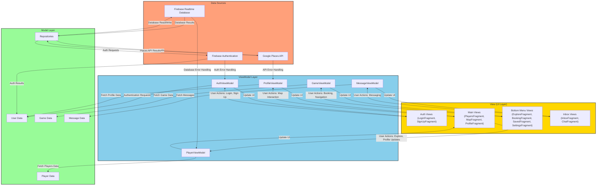

# **HoopHub**

This version improves readability and provides a clear call-to-action. Let me know if you'd like additional tweaks!
HoopHub is a basketball-focused mobile application designed to connect basketball enthusiasts by allowing users to explore nearby courts, manage player profiles, and communicate with others in their network. The app leverages **MVVM (Model-View-ViewModel)** architecture to ensure scalability, testability, and clean separation of concerns.

## Website for Our App  
Check out our official website [**HERE**](https://hoophub-website-ulnx.vercel.app/) to learn more about **HoopHub**!
---

## **Features**
- **Players Section**: Explore and manage players in your network.
- **Courts Section**: Discover nearby basketball courts using an interactive map.
- **Profile Section**: Update and view personalized user profiles.
- **Messaging**: Chat with other users and plan basketball activities.
- **Dynamic Data**: Real-time basketball court data fetched using the Google Places API.
- **Intuitive Navigation**: User-friendly navigation powered by top and bottom tab menus.

---

## **App Overview**

### **MainActivity**
The `MainActivity` serves as the entry point and primary navigation hub for the app. It manages:
1. **Top and Bottom Tab Layouts**:
    - **Top Tab Menu**: Switches between the Players, Courts, and Profile sections.
    - **Bottom Tab Menu**: Displays additional navigation options.
    - Icons and labels are dynamically generated using the `MenuIconCreator` utility class.

2. **Fragment Management**:
    - Fragments such as `PlayersFragment`, `MapFragment`, and `ProfileFragment` are initialized via the `fragmentSetup()` method.
    - `ViewPager2` enables seamless swiping between fragments.
    - Tabs and fragments are synchronized for a smooth and consistent UI experience.

---

## **Architecture**

### **MVVM (Model-View-ViewModel)**
HoopHub follows the **MVVM architecture** to streamline app development by separating business logic from the UI. This architecture ensures testability and scalability.

#### **Components**:
- **Model**: Represents data sources, including the Google Places API and local database entities.
- **View**: Composable UI components (e.g., `PlayersView`, `CourtsView`, `ProfileView`) display data to the user.
- **ViewModel**: Manages UI-related data, handles business logic, and serves as a bridge between the Model and View.

#### **MVVM Flow Diagram**:


---

### **Thread Management**
To handle operations efficiently, HoopHub uses background threads for API calls and database interactions, ensuring the main thread remains responsive for user actions.

#### **Thread Management Diagram**:

```mermaid
graph TB
    subgraph MainThread["Main Thread"]
        A1["MainActivity (UI Thread)"]
        A2["Fragment Management"]
        A3["Event Handlers (User Input)"]
    end

    subgraph ViewModels["ViewModels (Logic Layer)"]
        B1["AuthViewModel"]
        B2["GameViewModel"]
        B3["MessageViewModel"]
        B4["PlayerViewModel"]
        B5["ProfileViewModel"]
    end

    subgraph BackgroundThreads["Background Threads"]
        C1["Network Operations"]
        C2["Firebase Auth / Realtime DB"]
        C3["Google Places API"]
    end

    subgraph Models["Models (Data Layer)"]
        D1["User Data"]
        D2["Game Data"]
        D3["Messages Data"]
        D4["Players Data"]
        D5["Court Data"]
    end

    %% Main Thread Connections
    A1 -->|Manages UI Updates| A2
    A1 -->|Triggers Logic Requests| B1
    A2 -->|Routes User Events| A3

    %% ViewModel to Background Threads
    B1 -->|Firebase SignIn/SignUp| C2
    B2 -->|Fetch/Update Game Data| C2
    B3 -->|Send/Receive Messages| C2
    B4 -->|Fetch/Update Player Data| C2
    B5 -->|Fetch/Update Profile Data| C2

    %% Background Threads to Models
    C2 -->|Retrieve/Store Auth Data| D1
    C2 -->|Retrieve/Store Game Info| D2
    C2 -->|Retrieve/Store Messages| D3
    C2 -->|Retrieve/Store Player Data| D4
    C3 -->|Retrieve Court Data| D5

    %% Background Threads to ViewModels
    C2 -->|Return Auth Status| B1
    C2 -->|Return Game Data| B2
    C2 -->|Return Messages| B3
    C2 -->|Return Player Data| B4
    C3 -->|Return Court Data| B5

    %% ViewModels to Main Thread
    B1 -->|Update Auth UI| A1
    B2 -->|Update Game UI| A1
    B3 -->|Update Message UI| A1
    B4 -->|Update Player UI| A1
    B5 -->|Update Profile UI| A1

    %% Styling
    style MainThread fill:#FFD700,stroke:#333,stroke-width:2px
    style ViewModels fill:#87CEEB,stroke:#333,stroke-width:2px
    style BackgroundThreads fill:#98FB98,stroke:#333,stroke-width:2px
    style Models fill:#FFA07A,stroke:#333,stroke-width:2px

    %% Node Styles
    style A1 fill:#FFD700,stroke:#000,stroke-width:2px
    style A2 fill:#FFD700,stroke:#000,stroke-width:2px
    style A3 fill:#FFD700,stroke:#000,stroke-width:2px
    style B1 fill:#87CEEB,stroke:#000,stroke-width:2px
    style B2 fill:#87CEEB,stroke:#000,stroke-width:2px
    style B3 fill:#87CEEB,stroke:#000,stroke-width:2px
    style B4 fill:#87CEEB,stroke:#000,stroke-width:2px
    style B5 fill:#87CEEB,stroke:#000,stroke-width:2px
    style C1 fill:#98FB98,stroke:#000,stroke-width:2px
    style C2 fill:#98FB98,stroke:#000,stroke-width:2px
    style C3 fill:#98FB98,stroke:#000,stroke-width:2px
    style D1 fill:#FFA07A,stroke:#000,stroke-width:2px
    style D2 fill:#FFA07A,stroke:#000,stroke-width:2px
    style D3 fill:#FFA07A,stroke:#000,stroke-width:2px
    style D4 fill:#FFA07A,stroke:#000,stroke-width:2px
    style D5 fill:#FFA07A,stroke:#000,stroke-width:2px


```


---

## **App Structure**

```plaintext
com.example.hoophub
├── ApiUtils.kt
├── AuthHostActivity.kt
├── MainActivity.kt
├── ProfileImageLauncher.kt
├── ProfileUtil.kt
├── SplashActivity.kt
├── ViewModel
│   ├── AuthViewModel.kt
│   ├── GameViewModel.kt
│   ├── MessageViewModel.kt
│   ├── PlayerViewModel.kt
│   └── ProfileViewModel.kt
├── adapter
│   ├── BookingCardAdapter.kt
│   ├── ChatAdapter.kt
│   ├── DialogAdapter.kt
│   ├── GameAdapter.kt
│   ├── MessageAdapter.kt
│   ├── ParticipantAdapter.kt
│   ├── PlayerCardAdapter.kt
│   ├── SearchAdapter.kt
│   └── ViewPagerAdapter.kt
├── data
│   ├── BasketballCourt.kt
│   └── PlaceApiResponse.kt
├── factory
│   ├── AuthViewModelFactory.kt
│   ├── MessageViewModelFactory.kt
│   └── ProfileViewModelFactory.kt
├── fragment
│   ├── Auth
│   │   ├── LoginFragment.kt
│   │   └── SignUpFragment.kt
│   ├── BottomMenu
│   │   ├── BookingFragment.kt
│   │   ├── ExploreFragment.kt
│   │   ├── SavedFragment.kt
│   │   └── SettingsFragment.kt
│   ├── GamesFragment.kt
│   ├── Inbox
│   │   ├── ChatFragment.kt
│   │   └── InboxFragment.kt
│   ├── InviteBottomSheetFragment.kt
│   ├── MainFragment.kt
│   └── TopMenu
│       ├── EditProfileFragment.kt
│       ├── MapFragment.kt
│       ├── MapPopupFragment.kt
│       ├── MapScreen.kt
│       ├── MapSelectionScreen.kt
│       ├── PlayersFragment.kt
│       └── ProfileFragment.kt
├── model
│   ├── BookingCard.kt
│   ├── Dialog.kt
│   ├── Game.kt
│   ├── Message.kt
│   ├── PlayerCard.kt
│   └── User.kt
├── network
│   └── GooglePlacesAPI.kt
└── repository
    ├── AuthRepository.kt
    ├── GamesRepository.kt
    ├── MessageRepository.kt
    ├── PlayersRepository.kt
    ├── ProfileRepository.kt
    └── UserRepository.kt

```

---

## **Getting Started**

### **1. Prerequisites**
- **Android Studio**: Install the latest version.
- **Google Maps API Key**: Obtain your API key and configure it in the project.

### **2. Setting up `local.properties`**
1. **Create the `local.properties` file** in the root directory of the project.
2. Add the following entries to the file:
   ```properties
   MAPS_API_KEY=your_api_key_here   # Replace with the API key provided in Canvas
   sdk.dir=/Users/<your_username>/Library/Android/sdk   # Update this path based on your system
   ```

   **Note**:
    - macOS: `/Users/<your_username>/Library/Android/sdk`
    - Windows: `C:\\Users\\<your_username>\\AppData\\Local\\Android\\sdk`
    - Linux: `/home/<your_username>/Android/Sdk`

### **3. Clone the Repository**
Clone the repository using the following command:
```bash
git clone <repository-url>
```

### **4. Open in Android Studio**
- Launch Android Studio and open the project directory.

### **5. Build and Run**
- Add your Google Maps API key in `local.properties`.
- Build the project and run it on an emulator or a physical device.

### **6. Login**
- Use demo user
    - Email: `emma@gmail.com`
    - Passward: `emma123`
- Enjoy the app!
---

## **Team Contributions**
| Team Member          | Contributions                                                                 |
|-----------------------|-------------------------------------------------------------------------------|
| **Jeffrey Loverock**  | Profile page, Themes, Backend                                                |
| **Kristina Tretiakova** | Messaging, Backend, Login/Registration, Navigation, Games page              |
| **Taiga Okuma**       | MVVM Design, Map Integration, Nearest Court Feature, Backend                 |
| **Paul Atwal**        | Players page, Invites, Bookings Page, Backend                                |

---
